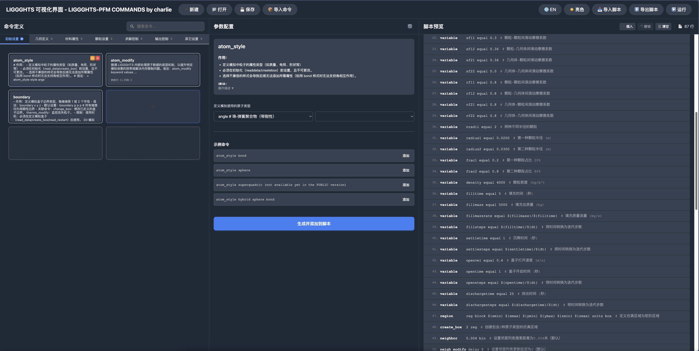

# LIGGGHTS Visual Interface

[中文版本](README_CN.md) | English

A visual command learning and script generation tool for LIGGGHTS/LAMMPS/PFC discrete element simulation programs.

## 🎯 Purpose

Provides a **blank command library framework** that encourages users to learn LIGGGHTS/LAMMPS syntax through creating their own command collections. Active learning is more effective than passive acceptance of preset commands.

## ✨ Key Features

### 📚 Custom Command Creation

- **Three-Column Editor**: Command Info | Parameter Definition | Example Commands
- **Parameter Configuration**: Multi-option dropdowns, flexible parameter settings
- **Example Integration**: One-click addition of example commands to scripts

### 🏗️ Visual Management

- **Seven Categories**: Initialization, Geometry, Materials, Particles, Solver, Output, Others
- **Grid Layout**: Drag-and-drop arrangement with persistent positioning
- **Cross-Tab Search**: Quick command search with automatic tab highlighting

### 📝 Script Generation

- **Real-Time Editing**: Double-click to modify script lines
- **Drag Reordering**: Adjust execution sequence
- **Color Coding**: Visual distinction by step types
- **Undo Function**: Support for operation rollback

### 💾 Project Management

- **Project Save/Load**: Complete state persistence
- **Command Library Import**: Import commands from other projects (non-overwriting)
- **Script Import/Export**: Support for .in/.lmp/.txt formats

## 🚀 How to Use

1. **Create Project**: Click "New Project" to create workspace
2. **Create Commands**: Select category → Click "+" → Fill command info → Save
3. **Generate Scripts**: Select command → Configure parameters → "Add to Script"
4. **Import Command Library**: Import command definitions from other project files
5. **Export Scripts**: Choose format (.in/.lmp/.txt) and save to simulation directory

**Recommended Browsers**: Chrome/Edge (full feature support)

## 📖 Related Resources

### LIGGGHTS Documentation

- [Official LIGGGHTS Documentation](https://www.cfdem.com/media/DEM/docu/Manual.html)
- [LIGGGHTS Command Reference](https://www.cfdem.com/media/DEM/docu/Section_commands.html)

### LAMMPS Documentation

- [LAMMPS Manual](https://docs.lammps.org/)
- [LAMMPS Commands](https://docs.lammps.org/commands_list.html)

### Discrete Element Method

- [DEM Theory and Applications](https://link.springer.com/book/10.1007/978-3-540-44490-7)
- [CFDem Project](https://www.cfdem.com/)

## 📄 License

This project is open source and available under the MIT License.

*This tool is designed to enhance your understanding of discrete element simulation commands through hands-on learning and visual organization.*

Open source project under MIT License.
